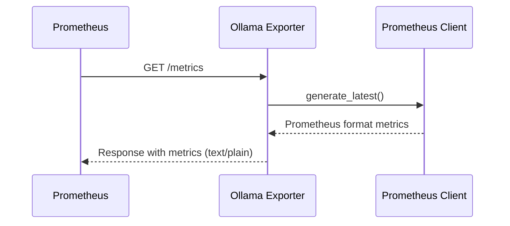
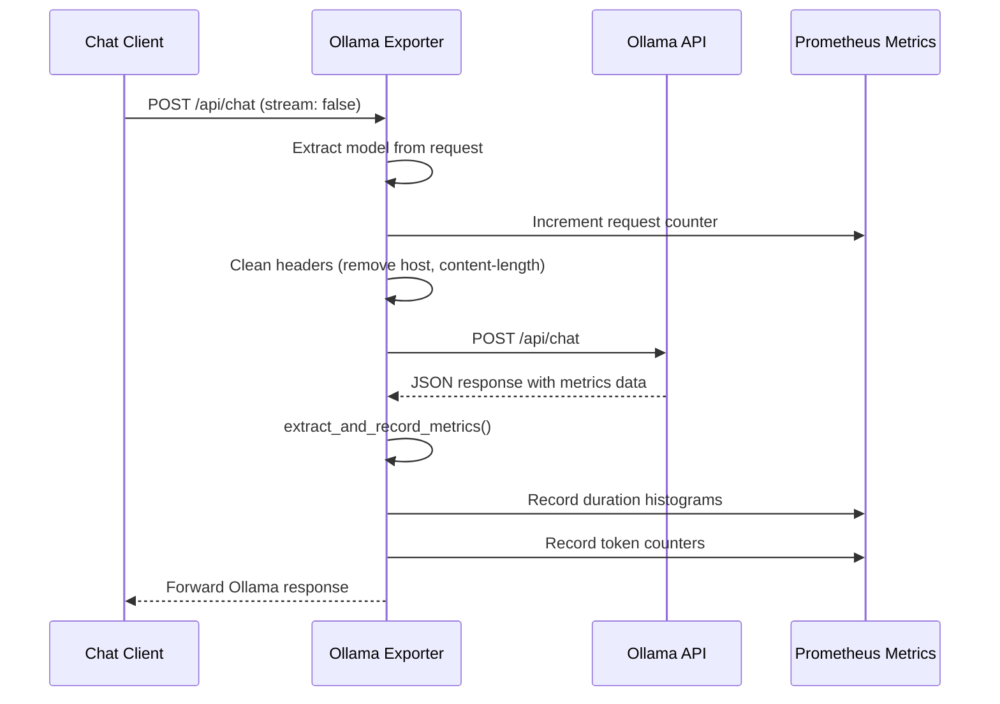
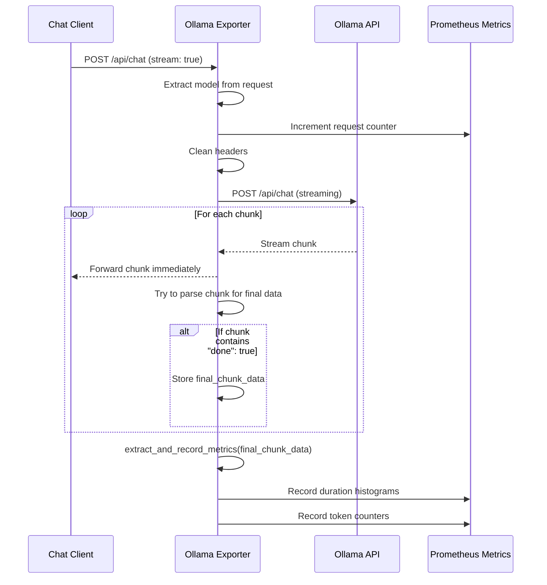
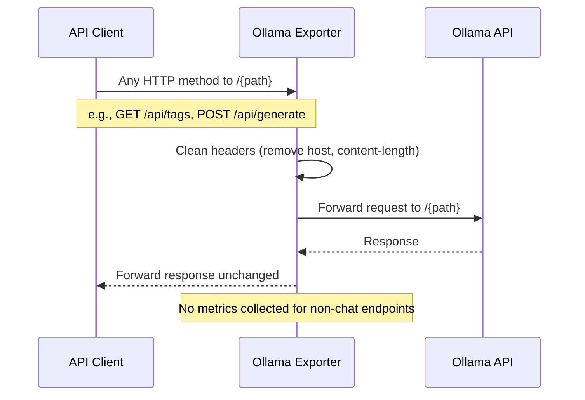

# Ollama Exporter Sequence Diagrams

This document contains sequence diagrams showing the common flows in the Ollama Prometheus Exporter.

## 1. Metrics Endpoint Flow

## 2. Non-Streaming Chat Request Flow

## 3. Streaming Chat Request Flow

## 4. Generic Proxy Flow (All Other Endpoints)

## Key Flow Characteristics

- **Transparent Proxy**: All non-chat requests pass through unchanged
- **Metrics Collection**: Only `/api/chat` requests have metrics extracted
- **Streaming Preservation**: Streaming responses are forwarded in real-time while collecting final metrics
- **Error Handling**: JSON parsing errors are silently ignored to maintain proxy transparency
- **Header Cleaning**: Host and content-length headers are removed before forwarding to prevent conflicts